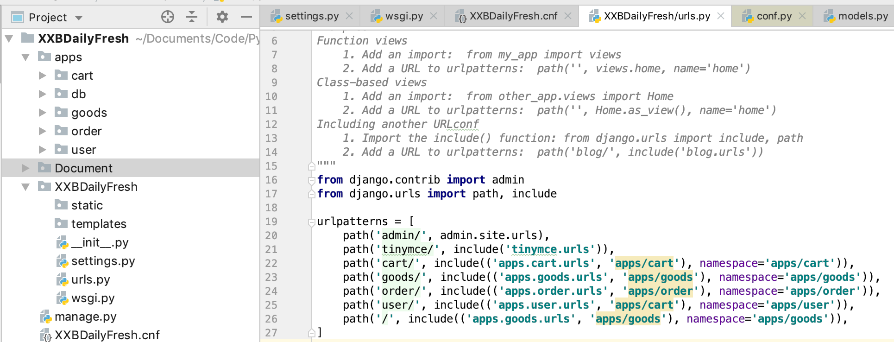
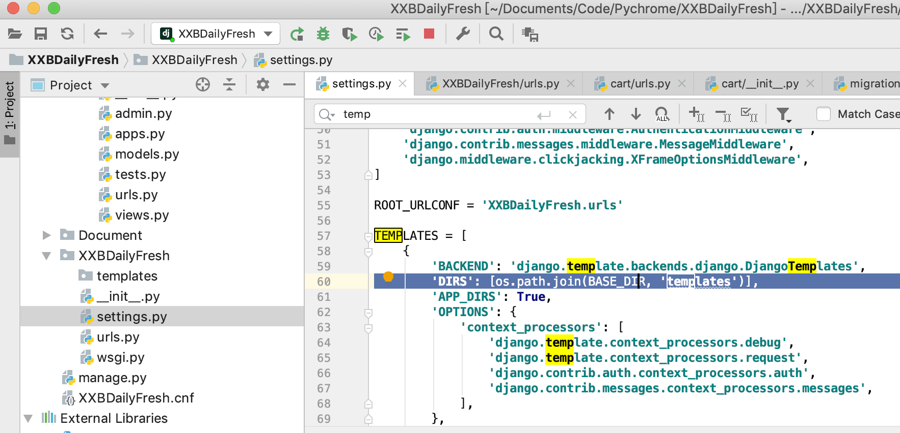
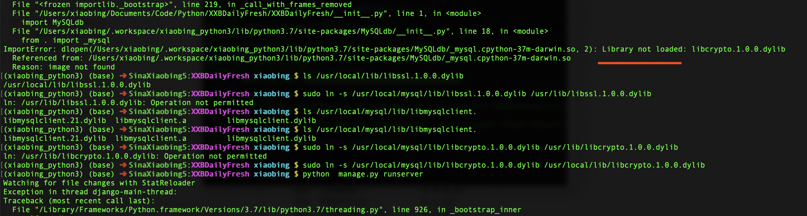
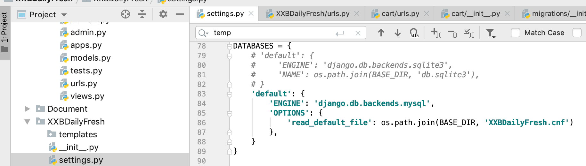
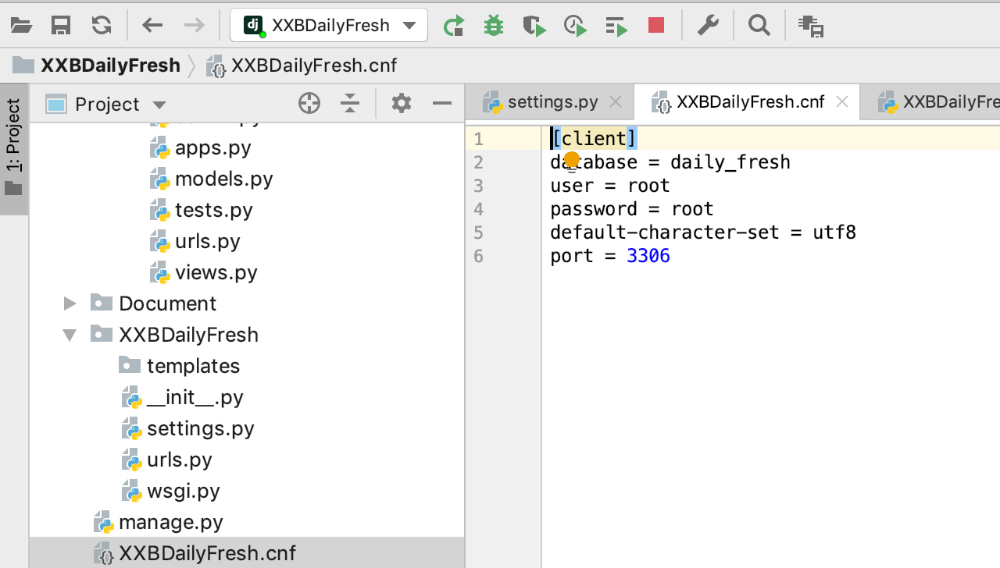
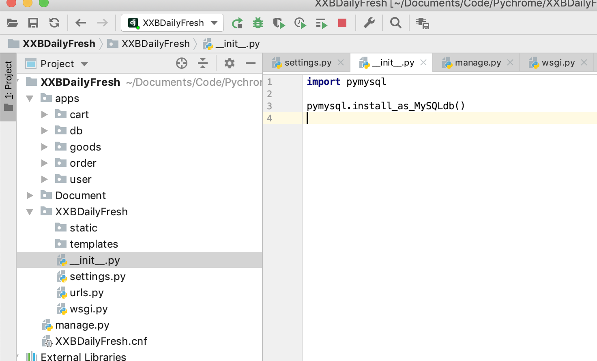
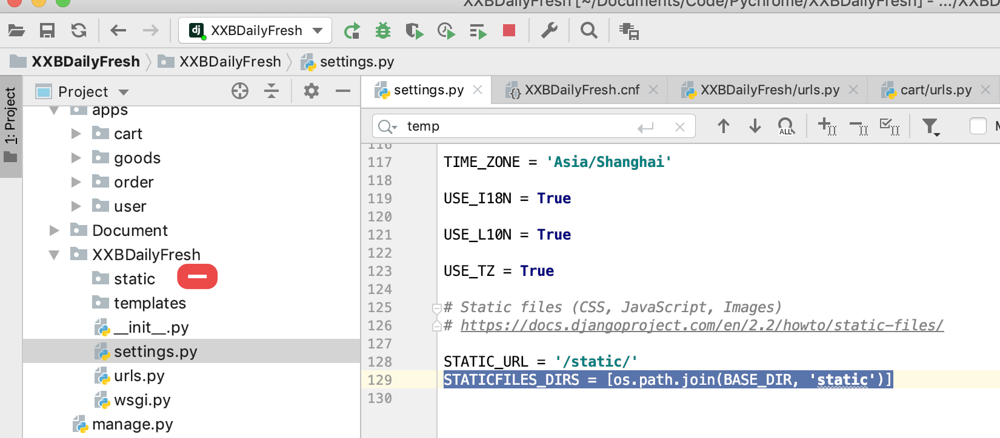
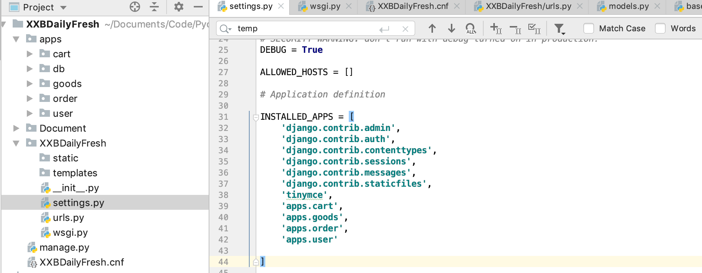
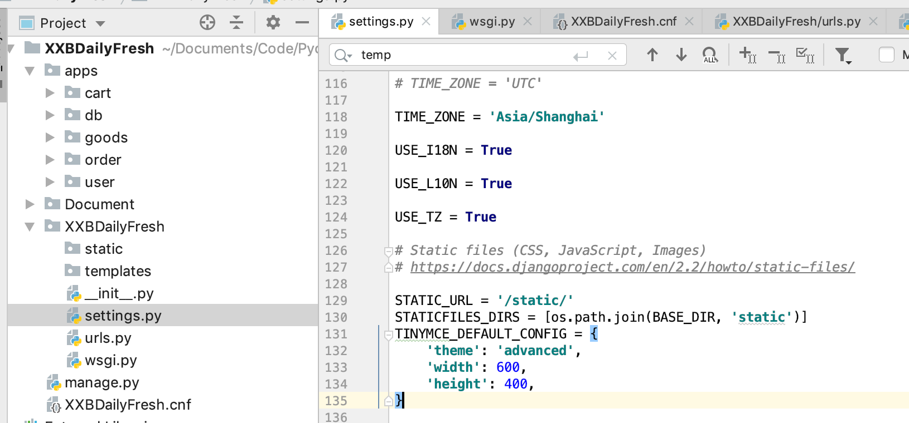
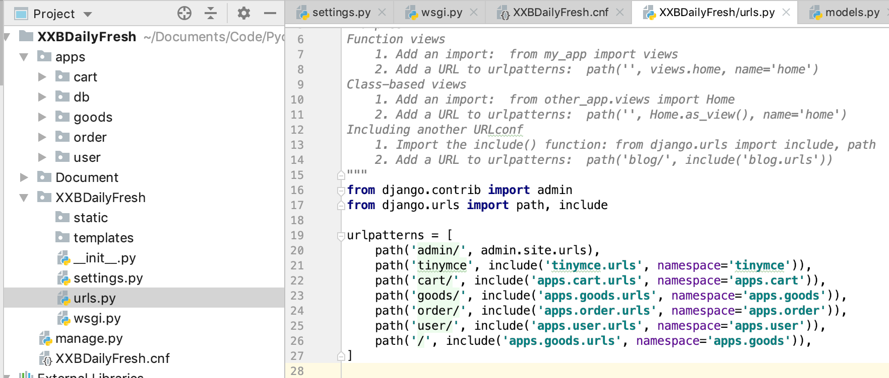

# 天天生鲜项目
>### 项目说明   django 版本号是 2.2.3
>### 开发参考文档  [django2.2官方文档-中文](https://docs.djangoproject.com/zh-hans/2.2/)
>### 开发参考文档  [django2.2官方文档](https://docs.djangoproject.com/en/2.2/)

```shell
	django-admin --version (python -m django --version)
	2.2.3
```
### 1、初始化配置

```c
	django-admin startproject XXBDaily

```

### 2、生成对应得app

>步骤2.1 -> 2.2 是直接创建应用到相应得目录下边，如果觉得命令比较复杂，可以直接创建应用，然后移动到想相应的目录里边，可以参考2.3

#### 2.1、创建app响应得目录的目录

```shell
	mkdir apps
	mkdir apps/user
	mkdir apps/goods 
	mkdir apps/cart
	mkdir apps/order
```
#### 2.2、创建响应得app
```shell
	python manage.py startapp (应用的名字) (应用的目录)
	python manage.py startapp user apps/user
	python manage.py startapp goods apps/goods
	python manage.py startapp cart  apps/cart
	python manage.py startapp order  apps/order
```

#### 2.3、(2.1 -> 2.2 实现方式2)
创建应用
```shell
	python manage.py startapp (应用的名字)
	python manage.py startapp user
	python manage.py startapp goods
	python manage.py startapp cart
	python manage.py startapp order
```
然后移动到应用到app目录下边
```shell
	mkdir apps/
	mv user apps/
	mv goods apps/
	mv cart apps/
	mv order apps/
```
#### 2.4、添加app到配置文件
##### 2.4.1、添加app到配置文件添加app到配置文件中

```python

	INSTALLED_APPS = [
	    'django.contrib.admin',
	    'django.contrib.auth',
	    'django.contrib.contenttypes',
	    'django.contrib.sessions',
	    'django.contrib.messages',
	    'django.contrib.staticfiles',
	    'apps.cart',
	    'apps.goods',
	    'apps.order',
	    'apps.user'
	
	]
```

##### 2.4.2、 添加url到配置文件中 

```python
	urlpatterns = [
	    path('admin/', admin.site.urls),
	    path('tinymce/', include('tinymce.urls')),
	    path('cart/', include(('apps.cart.urls', 'apps/cart'), namespace='apps/cart')),
	    path('goods/', include(('apps.goods.urls', 'apps/goods'), namespace='apps/goods')),
	    path('order/', include(('apps.order.urls', 'apps/order'), namespace='apps/order')),
	    path('user/', include(('apps.user.urls', 'apps/cart'), namespace='apps/user')),
	    path('/', include(('apps.goods.urls', 'apps/goods'), namespace='apps/goods')),
	]
```

<center>
	
</center>

##### 2.4.3、配置temples
需要安装包

```c
	pip install mysqlclient
```


```python

	TEMPLATES = [
	    {
	        'BACKEND': 'django.template.backends.django.DjangoTemplates',
	        'DIRS': [os.path.join(BASE_DIR, 'templates')],
	        'APP_DIRS': True,
	        'OPTIONS': {
	            'context_processors': [
	                'django.template.context_processors.debug',
	                'django.template.context_processors.request',
	                'django.contrib.auth.context_processors.auth',
	                'django.contrib.messages.context_processors.messages',
	            ],
	        },
	    },
	]
```

<center>
	
</center>

<font color=red>帮助如果mysql报错类似下边可以参考下边得解决方案，添加软连接。</font>
<center>
	
</center>

```c
	sudo ln -s /usr/local/mysql/lib/libmysqlclient.21.dylib /usr/local/lib/libmysqlclient.21.dylib
	sudo ln -s /usr/local/mysql/lib/libssl.1.0.0.dylib /usr/local/lib/libssl.1.0.0.dylib

	sudo ln -s /usr/local/mysql/lib/libcrypto.1.0.0.dylib /usr/local/lib/libcrypto.1.0.0.dylib
```
##### 2.4.4、 配置数据库
```python

	DATABASES = {
	    # 'default': {
	    db_old
	    db_old
	    # }
	    'default': {
	        'ENGINE': db_old,
	        'OPTIONS': {
	            'read_default_file': os.path.join(BASE_DIR, 'XXBDailyFresh.cnf')
	        },
	    }
	}
```

<center>
	
</center>


```c
	[client]
	database = daily_fresh
	user = root
	password = root
	default-character-set = utf8
	port = 3306
```

<center>
	
</center>

__init.py文件初始化数据库

```c

	import pymysql
	pymysql.install_as_MySQLdb()
```

<center>
	
</center>
##### 2.4.5、 配置静态文件目录
```python
	STATICFILES_DIRS = [os.path.join(BASE_DIR, 'static')]
```

<center>
	
</center>

##### 2.4.6、 富文本支持
```python
	pip install django-tinymce==2.8.0
```
在配置文件app中添加
```
	INSTALLED_APPS = [
		  ......
	    'tinymce',
	    ......
	]
```
<center>
	
</center>

在配置文件添加富文本相关环境变量
```
	TINYMCE_DEFAULT_CONFIG = {
    'theme': 'advanced',
    'width': 600,
    'height': 400,
	}
```
<center>
	
</center>

在url中添加支持
```
	TINYMCE_DEFAULT_CONFIG = {
    'theme': 'advanced',
    'width': 600,
    'height': 400,
	}
```
<center>
	
</center>

### 3、处理数据库
#### 3.1、 生成数据库迁移文件

```c
	python manage.py makemigrations
```

#### 3.2、 应用迁移文件生成响应得数据库

```c
	python manage.py migrate
```

#### 3.2、 创建超级管理员

```c
	python manage.py createsuperuser
```


<center>
	
</center>
